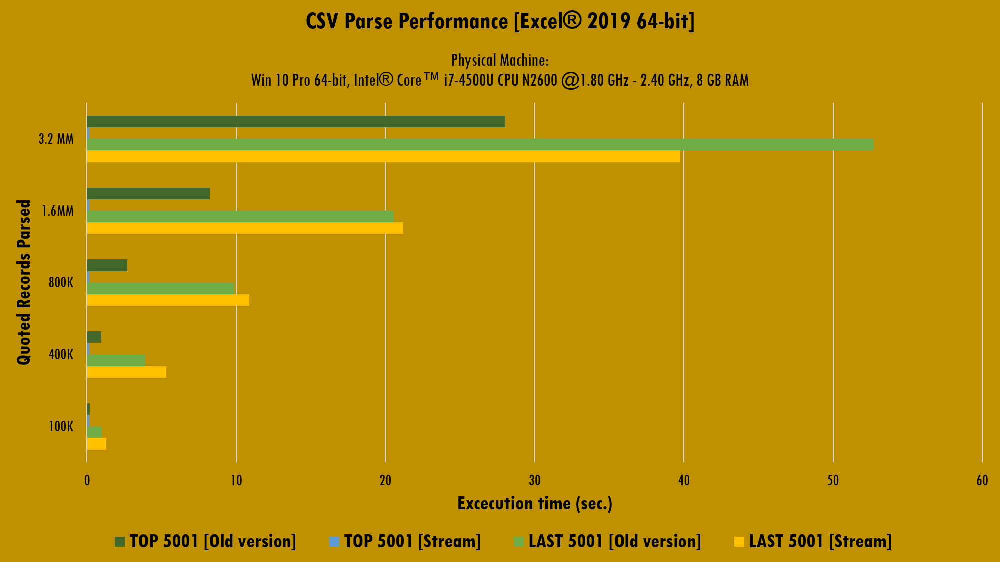
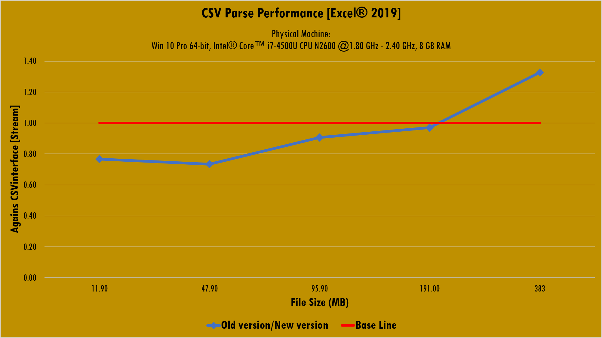

# Experimental results
{: .fs-9 }

---

VBA is the version of Visual Basic shipped with Microsoft Office. At this time, it's impossible to un-stick VBA code from host application main limitations. For example, an Excel Worksheet is limited to 1,048,576 rows, if user need more storage space a new Worksheet is required.

At the same time, Microsoft aims the 32-bit version of Excel is [limited to 4GB of RAM](https://docs.microsoft.com/en-us/office/troubleshoot/excel/laa-capability-change), on x64 OS’s, for most recent versions and to 2GB for versions up to 2013. Again, VBA can’t avoid this limitation.

By the fact CSV interface works, primarily, with `Variant/Strings` and [VBA uses 10 bytes + string length](https://docs.microsoft.com/en-us/office/vba/language/reference/user-interface-help/data-type-summary) for store this data type, a huge working load can let application run out of memory. Then, it’s crucial to set some boundary over the file size users can work from the CSV interface library. 

To achieve this, the first step is to study the performance of the VBA-CSV interface when parsing 5K records from the top and from the end of files with varying size, and then establish the recommended maximum amount of data that can be handled from the interface.

The pursued goal is to determine the behavior of the solution as the file size increases, due the following affirmation: as the peak memory used reach the limit of the available memory, VBA face a performance loss.

To accomplish the first step of this analysis, we’ll test the library agains the old version of the CSV interface.

The below graphs show the benchmark results for a set of CSV files with size ranked from almost 12 MB to almost 383 MB. Readers can download all the CSV used for this test [here.](https://raw.githubusercontent.com/ws-garcia/VBA-CSV-interface/master/csv-data/assets.zip)

>⚠️**Caution**
>{: .text-grey-lt-000 .bg-green-000 }
>The *assets.zip* file contains a .7z file inside. At least 629 MB of free disk space is required in order to decompress the files to the computer's hard drive.
{: .text-grey-dk-300 .bg-yellow-000 }

Up to here, we encountered the fact the new VBA-CSV interface is about 8 to 174 times faster than the old version when reading the first 5,001 records from files. In the same way, the new and the old version of the CSV interface have practically the same performance when reading the last 5,001 records from little sized files.

The data shows that the file size is controlling the performance of the old version of the CSV interface: increasing the size increases the time required to parse the data, no matter the number of records to be parsed.

## CSV file size considerations

The above experimental results make smooth to arrive to the following conclusions:

* VBA-CSV interface is suitable to almost any Microsoft Office Excel user. It can handle considerably large CSV files (383 MB) without any problem.
* Work with files over 191 MB can slow down the VBA performance. Import all the records of this kind of files is not recommended.
* The amount of data to be parsed controls the VBA-CSV interface performance, not the file size.

>⚠️**Caution**
>{: .text-grey-lt-000 .bg-green-000 }
>In theory, the target CSV can't have size greater than 2GB. This because VBA-CSV interface use `LONG` datatype when parsing. So, if you want to process files larger than 2GB, you'll need to use another solution instead.
{: .text-grey-dk-300 .bg-yellow-000 }
